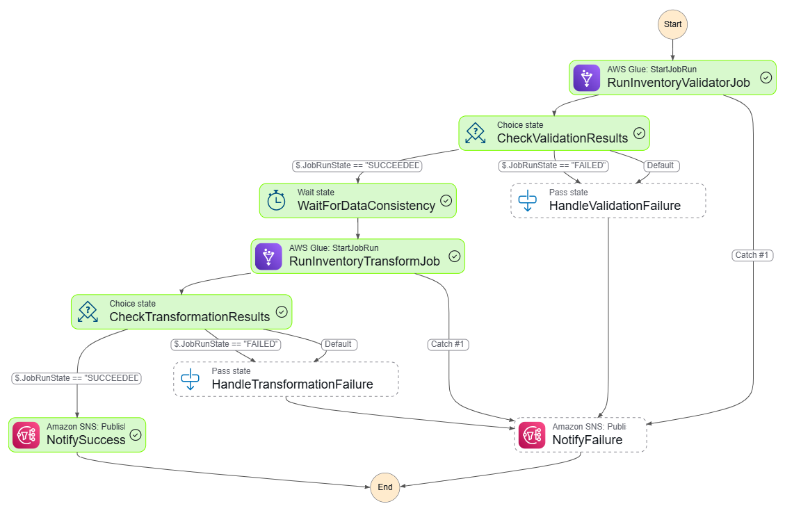

# Inventory Batch Pipeline

## Overview
Processes inventory updates from batch files and loads them into the system after validation and transformation.


**Inventory Batch Processing Pipeline**:
   - Processes hourly inventory batch data (JSONL format) from an S3 source.
   - Validates, transforms, and stores data in a Delta Lake table for querying.
   - Orchestrated by AWS Step Functions, with Lambda triggers and Glue jobs.


   ### Inventory Batch Processing Pipeline
- **AWS Lambda (`lambda_module.py`)**: Triggers the pipeline by detecting new JSONL files in `s3://batch-data-source-v1/inventory/`, moves them to `s3://misc-gtp-proj/landing_zone/raw/inventory/`, and starts the Step Function.
- **AWS Glue - Validation (`inventory_validate.py`)**: Validates JSONL files for schema and business rules, writing valid data as Parquet to `s3://misc-gtp-proj/landing_zone/validated/inventory/` and invalid data to `s3://misc-gtp-proj/landing_zone/rejected/inventory/`.
- **AWS Glue - Transformation (`inventory_transform.py`)**: Transforms validated data, enforces data types, deduplicates, and writes to a Delta Lake table in `s3://misc-gtp-proj/landing_zone/processed/inventory/` partitioned by date.
- **AWS Step Functions (`inventory_step_function.asl.json`)**: Orchestrates validation, transformation, and notifications.
- **Amazon S3**: Stores raw, validated, processed, rejected, and archived data, plus logs (`s3://misc-gtp-proj/logs/glue/inventory/`).
- **Amazon SNS**: Sends notifications to `arn:aws:sns:us-east-1:985539772768:inventory_alert`.
- **Amazon CloudWatch**: Logs metrics and execution details.


**Invetory Step Function Graph**


## Setup Instructions

### 1. Inventory Batch Processing Pipeline

1. **S3 Setup**:
   - Create buckets: `misc-gtp-proj`, `batch-data-source-v1`, `batch-archive-grp2`.
   - Structure: `landing_zone/raw/inventory/`, `landing_zone/validated/inventory/`, `landing_zone/processed/inventory/`, `landing_zone/rejected/inventory/`, `logs/glue/inventory/`, `state/inventory/`.

2. **Lambda Deployment**:
   - Package `lambda_module.py` with `boto3`:
     ```bash
     pip install boto3 -t lambda_package
     cp lambda_module.py lambda_package/
     cd lambda_package
     zip -r lambda_function.zip .
     ```
   - Create Lambda function (`inventory_trigger`, Python 3.8+, handler: `lambda_module.lambda_handler`).
   - Set environment variables: `STATE_MACHINE_ARN`, `PROJECT_BUCKET`, `LOG_FILE_PREFIX`, `BATCH_SOURCE_BUCKET`, `INVENTORY_SOURCE_PREFIX`.
   - Configure SQS trigger (batch size: 100, timeout: 15 min, memory: 256 MB).

3. **Glue Jobs**:
   - **Validation (`inventory_validator`)**:
     - Upload `inventory_validate.py` to `s3://misc-gtp-proj/scripts/`.
     - Create Python Shell job (Python 3.9, dependencies: `boto3`, `pandas`, `pyarrow`).
   - **Transformation (`inventory_transform`)**:
     - Upload `inventory_transform.py` to `s3://misc-gtp-proj/scripts/`.
     - Create Spark job (Glue 4.0, Delta Lake JAR: `delta-core_2.12:2.4.0`).
     - Set timeout: 120 min.

4. **Step Function**:
   - Upload `inventory_step_function.asl.json` to `s3://misc-gtp-proj/state_machines/`.
   - Create state machine (`InventoryProcessing`, Standard type).
   - Update `TopicArn` and `JobName` in ASL definition.

5. **SNS and Monitoring**:
   - Create SNS topic (`inventory_alert`).
   - Configure CloudWatch metrics: `FilesProcessed`, `FilesSucceeded`, `FilesRejected`, `FilesErrored`.

6. **Test**:
   - Upload sample JSONL to `s3://batch-data-source-v1/inventory/`:
     ```json
     {"inventory_id": 1, "product_id": 101, "warehouse_id": 201, "stock_level": 100, "restock_threshold": 20, "last_updated": 1697059200.0}
     ```
   - Trigger via SQS or S3 event, monitor logs, and query Delta Lake table.


## Usage

- **Inventory Pipeline**:
  - Input: JSONL files in `s3://batch-data-source-v1/inventory/`.
  - Output: Delta Lake table in `s3://misc-gtp-proj/landing_zone/processed/inventory/`.
  - Query via Athena for inventory KPIs (e.g., turnover, stockouts).


## Error Handling

- **Inventory**:
  - Invalid JSONL records stored in `s3://misc-gtp-proj/landing_zone/rejected/inventory/`.
  - SNS notifications for pipeline failures.
  - CloudWatch logs for Lambda and Glue errors.


## Troubleshooting

- **Inventory**:
  - **Lambda Failures**: Check CloudWatch logs for `inventory_trigger`.
  - **Glue Failures**: Review logs for `inventory_validator`/`inventory_transform`.
  - **Data Issues**: Validate JSONL against schema in `Shopware V1.pdf`.


## Limitations

- **Inventory**: Assumes JSONL input with epoch timestamps.

## Future Improvements

- **Inventory**:
  - Add validation rules in `inventory_validate.py`.
  - Extend Step Function for new data sources.
  - Enhance scalability for larger datasets.