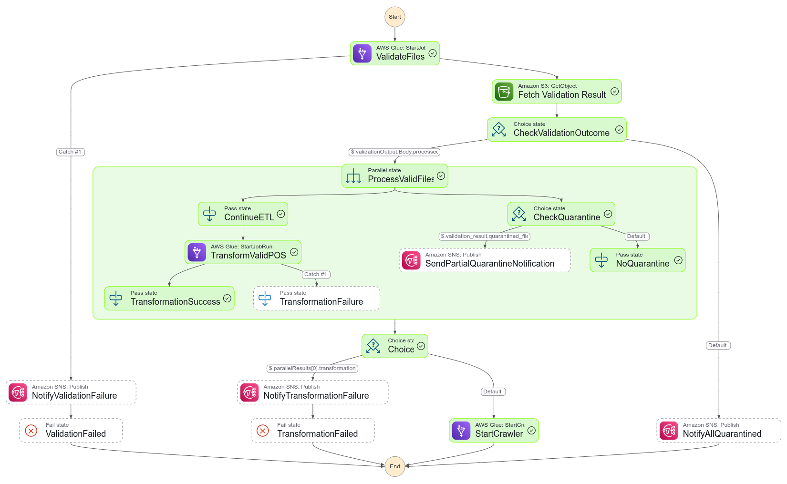

# POS Batch ETL Pipeline

## Overview

This project implements a **batch ETL pipeline** using **event-driven architecture** designed for daily ingestion of POS (Point of Sale) data. The pipeline ensures data validation, transformation, KPI calculation, and organized storage in **Delta Lake format**, enabling reliable access for downstream analytics.

The pipeline is orchestrated using **AWS Step Functions** with integration to **AWS Lambda** and **AWS Glue Jobs**, and utilizes **Amazon S3** as the primary data source.

---

## ETL Workflow

1. **Data Arrival**
   - POS data is expected daily and uploaded into an Amazon S3 source bucket.

2. **Trigger Event**
   - An **S3 event** (based on object creation) triggers a **Lambda function**.
   - This Lambda initiates an **AWS Step Function**, passing the **event time** as input.

3. **Validation State (Glue Job)**
   - A **Glue Python Shell Job** is invoked to:
     - Validate each incoming file based on schema and content.
     - Save a **validation summary** as a JSON file (including the event time) in S3.
     - Move **invalid files** to a rejected bucket.
   - The validation job writes its output to a validation result location in S3.

4. **Decision State**
   - A Step Function state checks the validation summary to determine:
     - If **at least one file passed validation**, it proceeds to the transformation job.
     - Otherwise, it **sends a failure notification** and ends the workflow.

5. **Transformation & KPI Computation (Glue Spark Job)**
   - A Spark Glue Job reads the validated files and:
     - Transforms the data into cleaned, curated format.
     - Appends the result to a **Delta Lake table**, partitioned by date.
     - Computes **sales KPIs**:
       - Total sales per product per day.
     - Updates a **KPI Delta table** using **MERGE logic (upsert)**.

6. **Monitoring & Notification**
   - **CloudWatch Logs** are used for debugging and tracking job status.
   - Failure notifications are sent for:
     - Step Function errors.
     - No valid files post-validation.

---

## ETL Workflow Diagram

You can insert a visual of your Step Function workflow to better illustrate the control flow and state transitions.

---

## POS Data Schema

The incoming data follows the schema below:

| Field             | Type    | Required | Notes                     |
|------------------|---------|----------|---------------------------|
| transaction_id    | String  | Yes      | Unique transaction ID     |
| store_id          | Integer | Yes      | Store identifier          |
| product_id        | Integer | Yes      | Product sold              |
| quantity          | Integer | Yes      | Units sold                |
| revenue           | Float   | Yes      | Total sale amount         |
| discount_applied  | Float   | No       | Discount value            |
| timestamp         | Float   | Yes      | Time of transaction (epoch timestamp) |

---

## Storage Format

- **Delta Lake** is used for storing both curated data and KPI outputs.
- Tables are **partitioned by `date`** (extracted from `timestamp`) to optimize querying and processing.

---

## IAM and Security

- **Glue Jobs** are assigned **least-privilege IAM roles** with:
  - Read/write access to their respective S3 buckets.
  - CloudWatch logging permissions for diagnostics.

- **Step Functions** are granted permissions to:
  - Start and monitor Glue jobs.
  - Access S3 and validation results.
  - Trigger crawlers (if needed).

---

## Summary

This pipeline enables a reliable, secure, and automated way to process daily batch POS data by integrating validation, transformation, and KPI computation in a scalable and auditable manner using AWS-native services.

