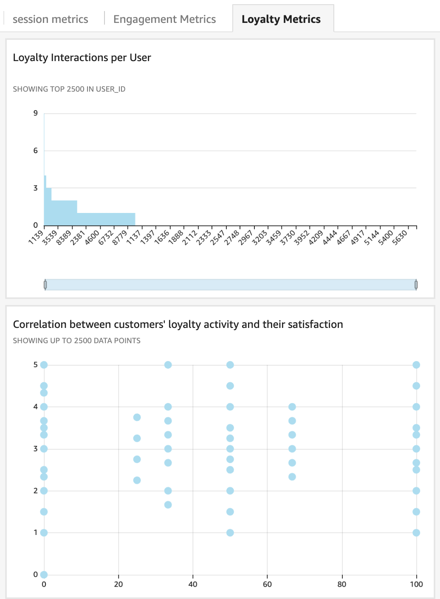
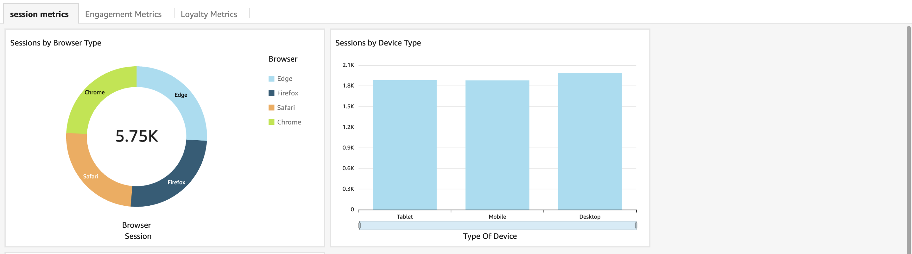

#  Web Analytics Pipeline
This pipeline ingests, transforms, stores, and analyzes real-time web event data using AWS-managed services. It is designed to collect event data via a public API, process it into a queryable format, and deliver insights such as engagement scores and loyalty metrics through Athena queries.


## Web Analytics Pipeline
- **API Consumer (`api.py`)**: Polls a web traffic API, validates events, and streams them to Kinesis.
- **Transformation Lambda (`transformation.py`)**: Processes Kinesis records, validates, transforms, and writes Parquet files to `s3://weblogs-bucket-gtp/events/` with year/month/day/hour partitioning.
- **Athena Partition Registration (`s3toathena.py`)**: Registers new S3 partitions in Athena for querying.
- **Analytics Queries (`script.sql`)**: Computes engagement (session duration, event counts) and loyalty metrics (engagement scores, loyalty rates).
- **ECS Fargate Task (`api_taskdefinition.json`, `dockerfile-api`)**: Runs the API consumer as a Dockerized service.
- **Amazon S3**: Stores events, failed records, and Athena query results.
- **Amazon SNS**: Notifies on validation failures.
- **Amazon CloudWatch**: Logs pipeline execution.

### Dashboard View
**Loyalty Metrics**


**Session_Metrics**



###  Set Up

1. **S3 and Athena Setup**:
   - Create bucket: `weblogs-bucket-gtp`.
   - Set up Athena database and table with partitions (year, month, day, hour).
   - Configure `athena_output` prefix.

2. **API Consumer (ECS Fargate)**:
   - Build Docker image:
     ```bash
     docker build -t weblogs-api -f dockerfile-api .
     ```
   - Push to ECR:
     ```bash
     aws ecr get-login-password --region us-east-1 | docker login --username AWS --password-stdin 985539772768.dkr.ecr.us-east-1.amazonaws.com
     docker tag weblogs-api:latest 985539772768.dkr.ecr.us-east-1.amazonaws.com/weblogs/api-gtp:api
     docker push 985539772768.dkr.ecr.us-east-1.amazonaws.com/weblogs/api-gtp:api
     ```
   - Register task definition (`api_taskdefinition.json`):
     ```bash
     aws ecs register-task-definition --cli-input-json file://api_taskdefinition.json
     ```
   - Deploy ECS service.

3. **Lambda Functions**:
   - Package and deploy `transformation.py` (Kinesis trigger: `weblogs_stream`).
   - Package and deploy `s3toathena.py` (S3 trigger: `events/` prefix).
   - Set environment variables: `S3_BUCKET`, `SNS_TOPIC_ARN`, `ATHENA_DATABASE`, `ATHENA_TABLE`, `ATHENA_OUTPUT`, `REGION`.

4. **Analytics Queries**:
   - Use `script.sql` in Athena, replacing `<<$startdate>>` and `<<$enddate>>`.

5. **Monitoring**:
   - Check CloudWatch Logs for ECS and Lambda.
   - Monitor SNS for failure notifications.


## Usage
- **Web Analytics Pipeline**:
  - Input: Web events from API to Kinesis.
  - Output: Parquet files in `s3://weblogs-bucket-gtp/events/`.
  - Query via Athena using `script.sql` for engagement/loyalty metrics.

## Error Handling
  - **Web Analytics**:
  - Failed records stored in `s3://weblogs-bucket-gtp/failed_records/` and `failed_transformation_records/`.
  - SNS notifications for validation failures.
  - CloudWatch logs for ECS and Lambda.

## Troubleshooting
- **Web Analytics**:
  - **Missing Data in Athena**: Verify partitions (`SHOW PARTITIONS`), check `s3toathena.py` logs.
  - **API Failures**: Monitor `api.py` logs in CloudWatch.
  - **Invalid Events**: Check `failed_records` in S3.


## Limitations
- **Web Analytics**: Expects JSON API responses, epoch timestamps, and standard partitioning.

## Future Improvements
- **Web Analytics**:
  - Add validation for event types.
  - Implement retry logic for Athena query failures.
  - Add throughput/latency metrics.